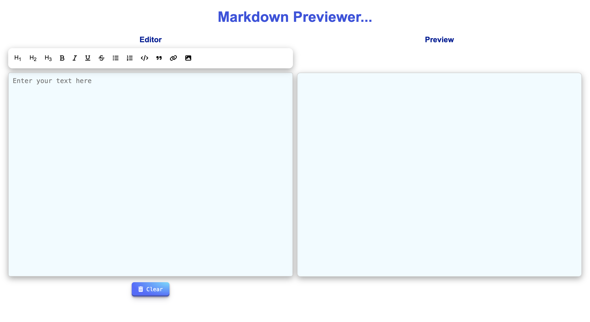

# Markdown Previewer

A simple real-time Markdown previewer that allows users to enter Markdown syntax in a textarea and see the formatted output instantly. This project is built using HTML, CSS, and JavaScript with the Marked.js library for Markdown parsing.

## Features

1. **Real-time Markdown Preview** - Enter Markdown text and see the formatted output instantly.  

2. **Supports Basic Markdown Syntax:**
   - Headings (`# H1`, `## H2`, etc.)
   - Bold, Italics, Underline, Strikethrough
   - Links and images
   - Lists (ordered and unordered) 
   - Supports inline and multi-line code blocks using syntax highlighting.
   - Code Block Highlighting 
3. **Responsive Design** - Works on both mobile and desktop devices.

## Screenshots

## Deployment and Project Links
<!-- Live Demo: [Your Deployment Link Here](link) 
Github Link:  -->